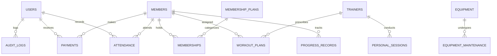

# FitCore — Database Design & Schema Documentation

## 1. Database Architecture
- **Engine**: SQLite 3 (via Qt `QSQLITE` driver)
- **File Path**: `data/fitcore.db`
- **Foreign Key Enforcement**: `PRAGMA foreign_keys = ON;`
- **Journal Mode**: `PRAGMA journal_mode = WAL;` (Write-Ahead Logging for high performance)
- **Synchronous Mode**: `PRAGMA synchronous = NORMAL;`

---

## 2. Entity-Relationship Diagram (ERD)

---

## 3. Relational Schema Summary (22 Tables)

1. `roles`: User permission definitions (`Admin`, `Manager`, `Receptionist`, `Trainer`).
2. `users`: Credentials, salt, hashed passwords, active status.
3. `members`: Member profile details (`MEM-XXXXXX`), contact, emergency info.
4. `membership_plans`: Available plan packages (duration, price, access type).
5. `memberships`: Active and historical plan assignments (`Active`, `Expired`, `Cancelled`).
6. `trainers`: Trainer details (`TRN-XXXXXX`), specialization, experience.
7. `trainer_members`: Many-to-many junction assigning members to trainers.
8. `personal_sessions`: Trainer personal session appointments with conflict detection.
9. `attendance`: Member check-in and check-out logs with duration calculation.
10. `payments`: Financial payment receipts (`REC-XXXXXX`), gross amount, discounts.
11. `expenses`: Gym operational expenditures by category.
12. `exercises`: Exercise library (muscle group, equipment required, difficulty).
13. `workout_plans`: Prescribed member workout plans.
14. `workout_plan_exercises`: Multi-exercise items (sets, reps, weight, rest seconds).
15. `workout_logs`: Member performance tracking logs.
16. `progress_records`: Body measurements and auto-calculated BMI entries.
17. `equipment`: Equipment inventory (`EQP-XXXXXX`), purchase details, condition.
18. `equipment_maintenance`: Service history and maintenance due schedules.
19. `notifications`: In-app system alerts for membership expiries and maintenance.
20. `audit_logs`: User activity and security audit trail.
21. `settings`: Gym profile parameters and key-value pair configuration.
22. `sqlite_sequence`: Auto-increment counter management.
